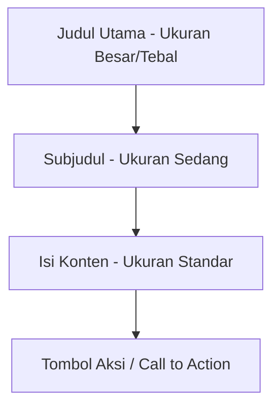

# Materi: Memahami Konsep Dasar Perancangan Web

**Mata Pelajaran:** Pemrograman Web  
**Jenjang:** SMK PPLG Kelas XI Semester 3

---

## Tujuan Pembelajaran

Setelah mempelajari materi ini, peserta didik mampu:
* Menjelaskan pengertian perancangan web.
* Memahami tahapan dalam proses pembuatan website.
* Mengidentifikasi komponen utama website.
* Menentukan struktur halaman website.
* Mendesain wireframe sederhana.
* Melakukan review terhadap sebuah website berdasarkan aspek UI dan UX.

---

## A. Pengertian Perancangan Web

**Perancangan web (Web Design)** adalah proses merencanakan tampilan, struktur, navigasi, serta pengalaman pengguna sebelum sebuah website dibuat.

Perancangan web bukan hanya membuat tampilan menarik, tetapi juga memastikan website:
* Mudah digunakan
* Cepat diakses
* Informasi mudah ditemukan
* Responsif di berbagai perangkat
* Memiliki tampilan yang konsisten

> [!NOTE]
> **Contoh Kasus: Website Sekolah**  
> Website sekolah harus memudahkan siswa menemukan:
> * Profil sekolah
> * Jadwal pelajaran
> * Berita
> * Kontak
> * PPDB (Penerimaan Peserta Didik Baru)

---

## B. Tujuan Perancangan Web

Perancangan web bertujuan untuk:
1. Memberikan pengalaman pengguna (User Experience/UX) yang baik.
2. Membuat tampilan menarik (User Interface/UI).
3. Memudahkan navigasi.
4. Menyampaikan informasi secara efektif.
5. Mendukung kebutuhan pengguna.

---

## C. Tahapan Perancangan Website

### 1. Analisis Kebutuhan
Menentukan:
* Siapa pengguna website?
* Apa tujuan website?
* Informasi apa yang dibutuhkan?

> [!NOTE]
> **Contoh Kasus: Website Toko Online**  
> * **Pengguna:** Pembeli dan Admin.  
> * **Fitur:** Login, Produk, Keranjang, Checkout.

### 2. Perencanaan
Menentukan:
* Struktur menu
* Halaman
* Navigasi
* Warna
* Font

### 3. Wireframe
Wireframe merupakan sketsa sederhana tata letak website. Wireframe belum memiliki warna maupun gambar.

```text
-----------------------------------
| Logo                       Menu |
-----------------------------------
|                                 |
|             Banner              |
|                                 |
-----------------------------------
|  [Produk 1] [Produk 2] [Produk 3]|
-----------------------------------
|             Footer              |
-----------------------------------
```

### 4. Mockup
Mockup merupakan desain yang sudah diberi warna, font, ikon, dan gambar. Biasanya dibuat menggunakan:
* Figma
* Adobe XD
* Canva

### 5. Prototype
Prototype adalah simulasi website yang sudah bisa diklik sehingga pengguna dapat mencoba navigasi sebelum website dibuat.

### 6. Implementasi
Mengubah desain menjadi website menggunakan:
* HTML
* CSS
* JavaScript
* Framework (seperti React, Vue, Svelte, dll.)

### 7. Testing
Pengujian meliputi:
* Link & Tombol
* Form input
* Tampilan Mobile (Responsiveness)
* Kecepatan Website

---

## D. Struktur Website

Website umumnya terdiri atas:
* **Header:** Berisi logo, nama website, dan menu.
* **Navigation:** Berisi menu utama seperti *Home*, *About*, *Produk*, *Blog*, *Contact*.
* **Content:** Bagian utama yang berisi informasi atau konten halaman.
* **Sidebar (Opsional):** Berisi kategori, artikel terbaru, atau iklan.
* **Footer:** Berisi copyright, kontak, dan tautan sosial media.

---

## E. Prinsip UI (User Interface)

UI merupakan tampilan visual website.  
**Prinsip UI yang baik:**
* Warna konsisten
* Font mudah dibaca
* Tombol jelas
* Ikon mudah dipahami
* Layout rapi

> [!WARNING]
> ❌ Menggunakan terlalu banyak warna.  
> 
> [!TIP]
> ✅ Menggunakan maksimal 3–4 warna utama.

---

## F. Prinsip UX (User Experience)

UX merupakan pengalaman pengguna saat menggunakan website.  
**Website yang baik memiliki:**
* Loading cepat
* Navigasi jelas
* Informasi mudah dicari
* Responsif (fleksibel di berbagai layar)
* Mudah dipahami

---

## G. Responsive Web Design

Website harus dapat menyesuaikan ukuran layar berbagai perangkat seperti Desktop, Laptop, Tablet, dan Smartphone.

| Perangkat | Ilustrasi Layout |
| :--- | :--- |
| **Desktop** | `[ Produk 1 ]` `[ Produk 2 ]` `[ Produk 3 ]` (Sejajar horizontal) |
| **Mobile** | `[ Produk 1 ]`<br>`[ Produk 2 ]`<br>`[ Produk 3 ]` (Menumpuk vertikal) |

---

## H. Hierarki Visual

Informasi penting harus dibuat lebih menonjol agar mengarahkan perhatian pengguna.



---

## I. Pemilihan Warna

Setiap warna memiliki makna psikologis tertentu:

| Warna | Makna / Kesan |
| :--- | :--- |
| **Biru** | Profesional, Kepercayaan |
| **Hijau** | Alam, Segar, Pertumbuhan |
| **Merah** | Peringatan, Semangat, Mendesak |
| **Kuning** | Ceria, Perhatian |
| **Hitam** | Elegan, Mewah, Klasik |

---

## J. Tipografi

Aturan umum tipografi pada web:
* Gunakan maksimal 2 jenis font.
* Pastikan ukuran font mudah dibaca.
* Gunakan kontras warna yang tinggi antara teks dan latar belakang.

---

## K. Navigasi Website

Navigasi yang baik harus:
* [x] Konsisten di setiap halaman.
* [x] Tidak membingungkan pengguna.
* [x] Maksimal terdiri dari 7 menu utama.

---

## L. Contoh Struktur Website Sekolah

Berikut contoh alur struktur menu/halaman untuk Website Sekolah:

```
Beranda
 ├── Profil
 ├── Guru
 ├── Jurusan
 ├── Berita
 ├── Galeri
 └── Kontak
```

---

## M. Kesalahan Umum dalam Perancangan Web

* Terlalu banyak kombinasi warna.
* Ukuran font terlalu kecil.
* Ukuran file gambar terlalu besar (menyebabkan loading lambat).
* Menu navigasi yang membingungkan.
* Loading website lambat.
* Tampilan tidak responsif di perangkat mobile.
* Tombol aksi tidak terlihat jelas.

---

## N. Kesimpulan

Perancangan web adalah tahap krusial sebelum proses coding dimulai. Dengan desain yang matang, website menjadi lebih menarik secara visual, mudah digunakan, serta mampu memberikan pengalaman pengguna (UX) yang optimal.
