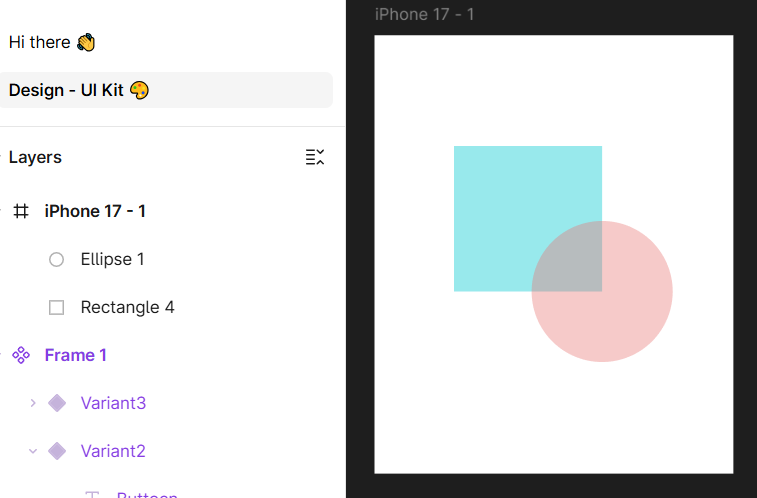
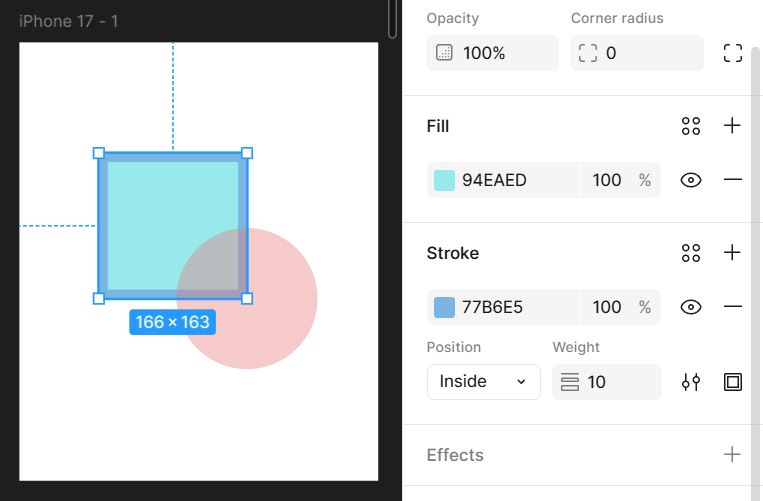
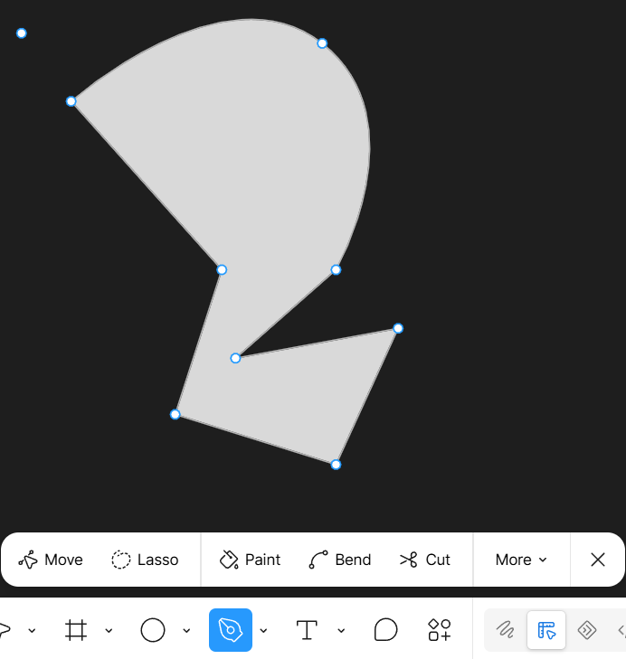
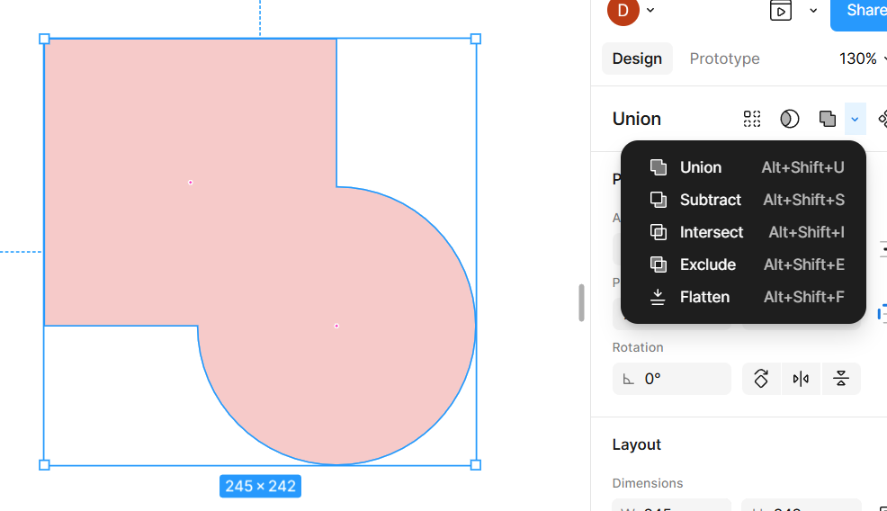

**Mata Pelajaran:** Pemrograman Web & Desain Grafis  
**Jenjang:** SMK TJKT / PPLG Kelas XI Semester 3  
**Topik:** Frame, Shape Tools, Coloring (Fill & Stroke), Vector Editing, dan Boolean Operations  
---

# Materi Pembelajaran: Objek Dasar & Vektor di Figma

## Tujuan Pembelajaran

Setelah mempelajari materi ini, peserta didik diharapkan mampu:
1. Membuat dan mengatur **Frame / Artboard** sesuai preset perangkat.
2. Memuat dan mengedit properti bentuk geometri dasar (*Rectangle*, *Ellipse*, *Polygon*, dan *Star*).
3. Menerapkan teknik pewarnaan (**Fill**, **Stroke**, **Gradient**, dan **Opacity**).
4. Menggunakan **Pen Tool** dan mengedit titik node (*Vector Editing*) untuk membuat bentuk kustom.
5. Menggabungkan bentuk menggunakan **Boolean Operations** (*Union*, *Subtract*, *Intersect*, *Exclude*).
---

## 1. Membuat Frame dan Artboard

**Frame** di Figma adalah kontainer utama yang bertindak sebagai kanvas atau *artboard* tempat kita menempatkan elemen antarmuka aplikasi/website (seperti layar HP, Tablet, atau Laptop).

### A. Perbedaan Frame dan Group
* **Frame (`F`)**: Memiliki preset ukuran standar, warna latar belakang (*Fill*), aturan *Auto Layout*, *Constraints*, serta fitur *Clip Content* (memotong elemen di luar batas kanvas).
* **Group (`Ctrl + G`)**: Pembungkus beberapa objek agar mudah dipindahkan bersama tanpa memiliki sifat kanvas atau aturan *layout* khusus.

### B. Cara Membuat Frame
1. Tekan shortcut tombol **`F`** pada keyboard.
2. Lihat pada **Panel Kanan (Design)**, pilih preset ukuran yang diinginkan:
   * **Phone**: iPhone 14/15, Android Large, Google Pixel.
   * **Tablet**: iPad Mini, iPad Pro.
   * **Desktop**: Desktop (1440 × 1024), MacBook Pro.
3. Atau klik & drag secara bebas di canvas untuk membuat ukuran kustom.
---

## 2. Shape Tools (Bentuk Geometri Dasar)

Figma menyediakan bentuk dasar yang dapat digunakan sebagai komponen utama antarmuka (seperti tombol, kartu, banner, dan foto profil).
Shortcut untuk memilih shape: Tekan tombol drop-down Shape di toolbar atau gunakan shortcut.

### A. Rectangle / Persegi Panjang (`R`)
* Digunakan untuk membuat tombol (*button*), kartu (*card*), latar belakang, dan garis pembatas.
* **Corner Radius**: Geser titik bulat (*handle*) di sudut dalam persegi untuk membuat sudut membulat (*rounded corners*).

### B. Ellipse / Lingkaran (`O`)
* Digunakan untuk foto profil (avatar), ikon indikator status, atau tombol lingkaran.
* **Presisi 1:1**: Tahan tombol `Shift` saat membuat elips agar membentuk lingkaran sempurna.
* **Arc Handle**: Tarik titik di tepi lingkaran untuk membuat bentuk donat atau diagram lingkaran (*pie chart*).

### C. Polygon (Segitiga)
* Digunakan untuk bentuk segitiga, segi-lima, segi-enam, atau ikon peringatan.
* **Count Property**: Ubah jumlah sudut pada seksi **Count** di panel kanan (contoh: isi `3` untuk segitiga, `6` untuk segi-enam/hexagon).

### D. Star / Bintang
* Digunakan untuk ikon rating/bintang, *badge* diskon, atau elemen dekoratif.
* **Property Bintang**:
  * **Count**: Jumlah sudut bintang (standar: 5).
  * **Ratio**: Kedalaman sudut bintang.
  * **Radius**: Keceraman sudut bintang.
---

## 3. Pewarnaan (Coloring: Fill & Stroke)

Pewarnaan dilakukan melalui **Panel Kanan (Design Tab)** saat sebuah objek dipilih.

### A. Fill (Warna Isi)
* **Solid**: Warna tunggal murni (contoh: `#2F80ED`).
* **Gradient**: Transisi gabungan beberapa warna:
  * *Linear*: Transisi lurus dari satu arah ke arah lain.
  * *Radial*: Transisi memancar dari titik tengah ke luar.
* **Image**: Mengisi objek dengan gambar (opsi *Fill*, *Fit*, *Crop*, *Tile*).
* **Eyedropper Tool (`I`)**: Mengambil contoh warna secara langsung dari objek atau gambar mana pun di canvas.

### B. Stroke (Garis Tepi)
* **Warna & Opasitas**: Mengatur warna dan tingkat transparansi garis.
* **Weight**: Ketebalan garis dalam piksel (contoh: `2px`, `4px`).
* **Stroke Position**:
  * *Inside*: Garis berada di dalam batas objek.
  * *Center*: Garis berada tepat di garis batas objek.
  * *Outside*: Garis berada di luar batas objek.
* **Advanced Stroke**: Mengatur jenis garis putus-putus (*Dashed line*) atau bentuk ujung garis (*Cap style*).
---

## 4. Pen Tool dan Vector Editing

**Pen Tool (`P`)** digunakan untuk membuat bentuk kustom, ikon unik, atau ilustrasi vektor yang tidak bisa dibuat hanya dengan bentuk dasar.

### A. Dasar Penggunaan Pen Tool (`P`)
1. **Garis Lurus**: Klik sekali di titik awal (A), lalu klik di titik berikutnya (B).
2. **Kurva / Garis Lengkung (Bézier Curve)**: Klik dan **tahan** mouse di titik B, lalu tarik (*drag*) kursor hingga muncul garis pengontrol (*Bézier Handle*).
3. **Menutup Jalur (Close Path)**: Klik kembali ke titik awal (A) untuk membentuk objek tertutup yang bisa diberi *Fill*.

### B. Mode Edit Vektor (Edit Object)
Untuk masuk ke mode edit vektor, **double-click** pada objek vektor atau tekan **`Enter`**.

* **Move Tool (`V`)**: Memindahkan titik nodus (*anchor point*).
* **Bend Tool (`Ctrl` / `Cmd`)**: Mengubah garis lurus menjadi garis lengkung bergelombang.
* **Paint Bucket (`B`)**: Mengisi warna pada area antar garis vektor tertutup (*Vector Network*).
* Klik tombol **Done** di toolbar atas jika telah selesai mengedit.
---

## 5. Boolean Operations (Operasi Gabungan Objek)

**Boolean Operations** digunakan untuk mengkombinasikan dua objek atau lebih menjadi satu bentuk kompleks baru.

Pilih minimal 2 objek yang saling bertumpukan (*overlap*), lalu pilih ikon **Boolean Groups** di toolbar bagian atas:

1. **Union Selection** (`A + B`):
   * Menggabungkan seluruh objek terpilih menjadi satu bentuk tunggal.
   * *Contoh*: Menggabungkan beberapa lingkaran dan persegi untuk membuat ikon awan.

2. **Subtract Selection** (`A - B`):
   * Objek di posisi paling atas akan memotong objek yang berada di bawahnya.
   * *Contoh*: Membuat bentuk bulan sabit (lingkaran dipotong oleh lingkaran lain) atau lubang pada ikon keranjang.

3. **Intersect Selection** (`A ∩ B`):
   * Menyisakan bagian objek yang saling tumpang tindih (*overlap*) saja.
   * *Contoh*: Membuat bentuk daun dari perpotongan dua lingkaran.

4. **Exclude Selection** (`A ⊕ B`):
   * Menghilangkan area yang saling tumpang tindih dan menyisakan area yang tidak bertumpukan.

