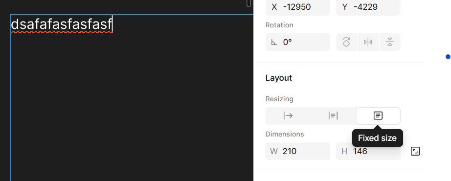
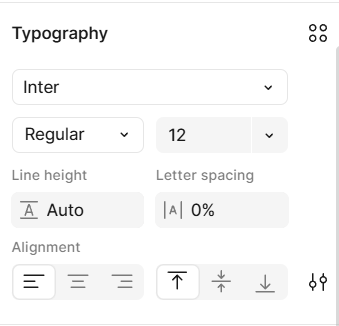
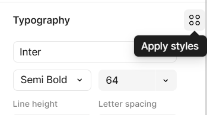

**Mata Pelajaran:** Pemrograman Web & Desain Grafis  
**Jenjang:** SMK TJKT / PPLG Kelas XI Semester 3  
**Topik:** Menambahkan Teks, Pengaturan Tipografi dan Text Styles
---

# Materi Pembelajaran: Tipografi & Teks Dasar di Figma

## Tujuan Pembelajaran

Setelah mempelajari materi ini, peserta didik diharapkan mampu:
1. Menambahkan teks ke canvas dan memilih jenis font yang tepat.
2. Mengatur properti teks (ukuran, *weight*, warna, *line height*, dan *letter spacing*).
3. Membuat dan mengelola **Text Style** yang dapat digunakan berulang kali (*reusable*).
---

## 1. Menambahkan Teks dan Memilih Font

Tipografi adalah salah satu elemen paling penting dalam pembuatan antarmuka (*User Interface*). Teks berfungsi untuk menyampaikan informasi secara jelas kepada pengguna.

### A. Cara Menambahkan Teks (`T`)
1. Tekan shortcut tombol **`T`** pada keyboard atau klik ikon **Text Tool** di toolbar.
2. Klik di mana saja pada area canvas lalu ketik teks yang diinginkan.

### B. Mode Kotak Teks (Text Box Resizing Behavior)
Di Figma, terdapat 3 perilaku ukuran kotak teks pada panel kanan seksi **Text**:

1. **Auto Width** :
   * Kotak teks melebar secara otomatis mengikuti panjang kalimat yang diketik secara horizontal dalam 1 baris.
2. **Auto Height** :
   * Lebar kotak teks terkunci/tetap, namun tinggi kotak teks akan bertambah otomatis ke bawah mengikuti jumlah baris kalimat (*word wrap*).
3. **Fixed Size** :
   * Lebar dan tinggi kotak teks dikunci pada ukuran tertentu. Jika teks terlalu panjang, teks akan terpotong (*overflow*) di luar batas kotak.

---

## 2. Mengatur Ukuran, Warna, dan Spasi Tipografi

Pengaturan properti teks dilakukan melalui **Panel Kanan (Design Tab)** pada bagian seksi **Text** dan **Fill**.

### A. Properti Utama Teks
* **Font Family**: Jenis font yang digunakan (contoh font UI populer: *Inter*, *Roboto*, *Poppins*, *Open Sans*).
* **Font Weight**: Ketebalan huruf:
  * *Regular* (400) - Teks paragraf biasa.
  * *Medium* (500) / *Semi-Bold* (600) - Sub-judul atau label tombol.
  * *Bold* (700) / *Extra Bold* (800) - Judul utama (*Heading*).
* **Font Size**: Ukuran teks dalam satuan piksel (`px`). Contoh: `32px` untuk Judul, `16px` untuk Paragraf utama, `14px` untuk teks mobile.

### B. Pengaturan Spasi dan Alignment
* **Line Height (Tinggi Baris)**:
  * Jarak vertikal antar baris teks dalam satu paragraf.
  * Rekomendasi: Gunakan persentase `130% - 150%` atau ukuran piksel (misal font size `16px`, line height `24px`) agar teks nyaman dibaca.
* **Letter Spacing (Kerning/Tracking)**:
  * Jarak horizontal antar karakter huruf.
  * Gunakan angka negatif (misal `-1%`) untuk judul berukuran besar agar rapat, dan angka positif (misal `2%` atau `5%`) untuk teks KAPITAL berukuran kecil.
* **Paragraph Spacing**: Jarak spasi kosong antar paragraf.
* **Text Alignment**: Meratakan arah teks (Rata Kiri, Rata Tengah, Rata Kanan, atau *Justify*).

---

## 3. Membuat Text Style yang Reusable

**Text Style** berfungsi untuk menyimpan kombinasi properti teks (Font, Weight, Size, Line Height) agar dapat digunakan kembali di seluruh halaman desain secara konsisten (*Design System*).

### A. Cara Membuat Text Style
1. Buat dan atur teks di canvas (contoh: Font *Poppins*, Bold, Size `24px`, Line Height `32px`).
2. Klik objek teks tersebut.
3. Pada **Panel Kanan** di seksi **Text**, klik ikon 4 titik (**Style / Style Menu**).
4. Klik tombol **`+` (Create Style)**.
5. Beri nama style sesuai hierarki tipografi (contoh: `Heading/H1`, `Heading/H2`, `Body/Regular`, `Button/Label`).
6. Klik **Create Style**.

### B. Keuntungan Menggunakan Text Style
Jika di kemudian hari kamu ingin mengubah jenis font seluruh halaman dari *Poppins* menjadi *Inter*, kamu cukup mengedit master **Text Style** tersebut sekali saja, dan **seluruh teks di semua halaman desain akan berubah secara otomatis!**

---

## Ringkasan Hirarki Tipografi UI Design

| Level Tipografi | Size (`px`) | Weight | Line Height | Contoh Penggunaan |
| :--- | :---: | :---: | :---: | :--- |
| **Heading 1 (H1)** | 32px - 40px | Bold | 120% - 130% | Judul Utama Halaman / Hero Section |
| **Heading 2 (H2)** | 24px - 28px | Semi-Bold | 130% | Judul Seksi / Title Kartu |
| **Body Regular** | 16px | Regular | 150% | Paragraf teks utama web |
| **Body Small** | 14px | Regular | 140% | Paragraf teks aplikasi mobile |
| **Button Text** | 14px - 16px | Semi-Bold | 100% | Label tombol (*Call to Action*) |
| **Caption** | 12px | Regular | 130% | Teks keterangan / timestamp |
