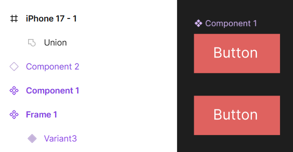

**Mata Pelajaran:** Pemrograman Web & Desain Grafis  
**Jenjang:** SMK TJKT / PPLG Kelas XI Semester 3  
**Topik:** Komponen Dasar, Main Component vs Instance, dan Konsep Overrides di Figma  
---

# Materi Pembelajaran: Komponen Dasar Figma (Components & Instances)

## Tujuan Pembelajaran

Setelah mempelajari materi ini, peserta didik diharapkan mampu:
1. Memahami konsep **Component** dan manfaatnya dalam menjaga konsistensi antarmuka (*UI Design*).
2. Membuat **Main Component** dari objek atau frame.
3. Membedakan antara **Main Component** dan **Instance**.
4. Menerapkan teknik **Overrides** pada Instance untuk menyesuaikan konten teks, warna, atau gambar.
---

## 1. Pengertian dan Manfaat Component

**Component** di Figma adalah elemen UI reusable (dapat digunakan berulang kali) yang berfungsi sebagai template master/induk. 
Contoh elemen UI yang wajib dijadikan Component:
* Tombol (*Button*)
* Kartu Produk / Berita (*Card*)
* Navbar / Header & Footer
* Form Input & Checkbox
* Ikon-ikon aplikasi

### Manfaat Menggunakan Component:
1. **Efisiensi Waktu**: Tidak perlu membuat ulang tombol atau kartu dari awal secara manual.
2. **Konsistensi Desain**: Seluruh tombol atau komponen di ratusan halaman aplikasi akan memiliki bentuk, warna, dan gaya yang seragam.
3. **Kemudahan Pembaruan (Global Update)**: Jika kamu mengubah warna atau ukuran pada **Main Component**, seluruh salinan (**Instance**) di semua halaman akan berubah secara otomatis!
---

## 2. Membuat Main Component dari Objek

### Langkah-langkah Membuat Component:
1. Buat dan atur elemen desain terlebih dahulu di canvas (contoh: buat sebuah Frame tombol yang berisi teks dan background warna).
2. Pilih Frame atau Objek tersebut.
3. Gunakan salah satu cara berikut untuk menjadikannya Component:
   * Klik ikon **Create Component** (❖) di toolbar bagian kanan atas.
   * Atau tekan shortcut **`Ctrl + Alt + K`** (Windows).
   * Atau klik kanan pada objek → pilih **Create Component**.

4. Setelah objek menjadi Component, ikon pada daftar **Layers** di panel kiri akan berubah menjadi **4 simbol berlian utuh (❖)** dan garis batas objek berwarna ungu.

---

## 3. Instance (copyan dari component)

Terdapat dua istilah utama saat bekerja dengan komponen di Figma:

| Karakteristik | Main Component (❖) | Instance (◇) |
| :--- | :--- | :--- |
| **Simbol Layer** | 4 Berlian Ungu Utuh (`❖`) | 1 Berlian Ungu Kosong (`◇`) |
| **Fungsi** | Master Induk / Template Asli | Salinan/duplikasi dari Main Component |
| **Efek Pembaruan** | Perubahan di Main akan menurunkan perubahan ke seluruh Instance. | Perubahan khusus (Overrides) di Instance **TIDAK** mempengaruhi Main Component. |
| **Lokasi** | Dibuat di canvas atau Design System. | Diambil dari tab **Assets** atau hasil duplikasi (`Ctrl + D` / `Alt + Drag`). |

---

## 4. Konsep Instance dan Overrides

### A. Apa itu Overrides?
**Overrides** adalah kemampuan untuk mengubah properti unik pada **Instance** tertentu tanpa merusak atau memutus hubungannya dengan **Main Component**.

### B. Properti yang BISA di-Override pada Instance:
* **Teks**: Mengubah isi tulisan di tombol atau kartu tanpa mengubah ukuran/font asli.
* **Warna (Fill & Stroke)**: Mengubah warna latar atau garis tepi pada instance tertentu (contoh: tombol status sukses warna hijau, status error warna merah).
* **Gambar**: Mengganti foto latar pada kartu produk/profil.
* **Efek & Shadow**: Menambahkan atau mengubah drop shadow.
* **Swap Instance**: Mengganti ikon di dalam tombol dengan ikon lain dari perpustakaan komponen.

### C. Properti yang TIDAK BISA di-Override pada Instance:
* Mengubah urutan layer di dalam instance.
* Menghapus elemen bawaan di dalam instance (elemen hanya bisa disembunyikan / *Hide Layer* `Ctrl + Shift + H`).

### D. Reset Overrides
Jika kamu ingin mengembalikan sebuah Instance yang sudah diubah-ubah warnanya atau teksnya kembali ke tampilan asli **Main Component**:
1. Klik pada **Instance** yang ingin dikembalikan.
2. Pada **Panel Kanan**, klik menu pilihan Instance (atau ikon titik tiga).
3. Pilih **Reset All Overrides**.

---
