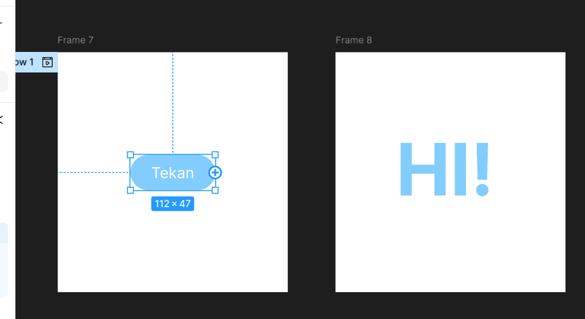
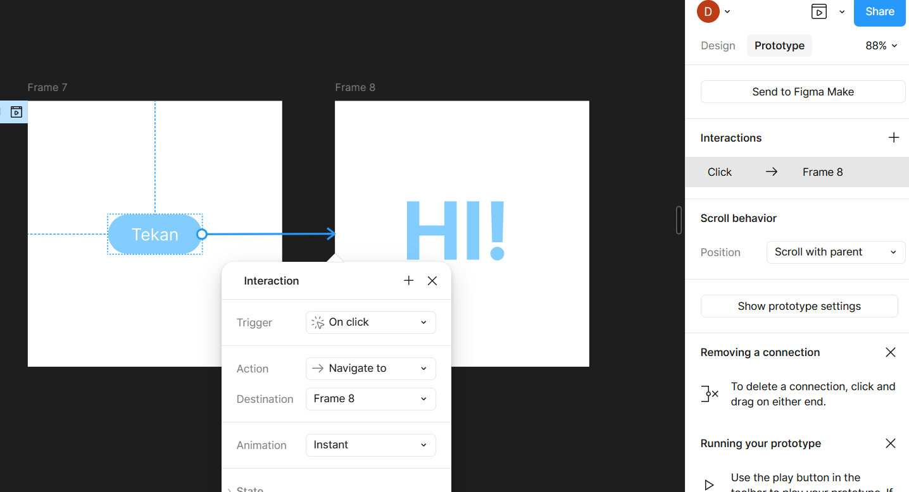
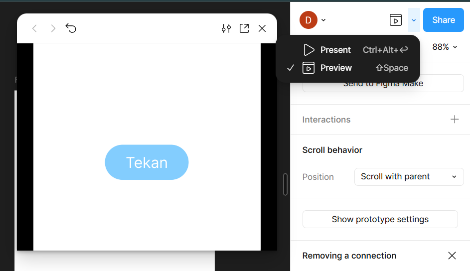

**Mata Pelajaran:** Pemrograman Web & Desain Grafis  
**Jenjang:** SMK TJKT / PPLG Kelas XI Semester 3  
**Topik:** Menghubungkan Frame dengan Interaksi, Animasi & Transisi, serta Preview & Berbagi Prototyping Figma  
---

# Materi Pembelajaran: Prototype Dasar di Figma

## Tujuan Pembelajaran

Setelah mempelajari materi ini, peserta didik diharapkan mampu:
1. Menghubungkan elemen UI antar frame menggunakan alur interaksi (**Interactions**).
2. Memahami pemicu interaksi (**Triggers**) dan jenis tindakan (**Actions**).
3. Mengatur efek **Animasi & Transisi** (termasuk *Smart Animate* dan *Easing*).
4. Menjalankan pengujian simulasi (**Preview/Present**) dan membagikan tautan prototype (*Share Link*).

---

## 1. Menghubungkan Frame dengan Interaksi

**Prototyping** adalah proses mengubah desain tampilan statis menjadi simulasi interaktif yang dapat diklik layaknya aplikasi nyata.
### A. Membuka Tab Prototype
1. Pilih **Tab Prototype** pada panel kanan (atau gunakan shortcut **`Shift + E`** untuk beralih antara tab Design dan Prototype).
2. Klik pada objek atau elemen UI yang ingin dijadikan tombol interaktif (contoh: tombol "Login").
3. Di sisi kanan objek, akan muncul titik lingkaran biru (*Hotspot Connection Node*).

### B. Menghubungkan Alur (Connecting Frames)
1. Klik dan tahan lingkaran biru tersebut, lalu tarik garis sambungan (*noodle connector*) ke Frame tujuan.
2. Jendela **Interaction Details** akan muncul secara otomatis di sebelah kanan.

### C. Pengaturan Interaction Details

#### 1. Trigger (Pemicu Interaksi)
Kapan aksi tersebut akan berjalan:
* **On Click / On Tap**: Aksi berjalan saat elemen diklik oleh mouse atau ditap pada layar HP.
* **On Hover (While Hovering)**: Aksi berjalan selama kursor berada di atas elemen (cocok untuk efek tombol hover).
* **On Press (While Pressing)**: Aksi berjalan selama mouse/jari menahan elemen.
* **After Delay**: Aksi berjalan secara otomatis setelah beberapa durasi waktu tanpa klik (cocok untuk *Splash Screen* atau *Auto-Slide Banner*).

#### 2. Action (Tindakan Hasil Interaksi)
Apa yang terjadi saat trigger dipicu:
* **Navigate To**: Berpindah langsung ke frame tujuan.
* **Open Overlay**: Membuka modal/popup di atas halaman aktif saat ini.
* **Scroll To**: Menggeser halaman ke seksi tertentu pada frame yang sama.
* **Back**: Kembali ke frame yang dibuka sebelumnya.

---

## 2. Mengatur Animasi dan Transisi

Animasi menentukan bagaimana transisi visual terjadi dari frame asal ke frame tujuan.

### A. Jenis Transisi (Transition Types)
* **Instant**: Berpindah seketika tanpa ada gerakan efek (cocok untuk pergantian tab cepat).
* **Dissolve**: Efek memudar (*fade-in / fade-out*) dengan halus.
* **Smart Animate**: 
  * Animasi tingkat lanjut yang mendeteksi perubahan ukuran, posisi, warna, atau sudut objek yang memiliki nama layer sama di kedua frame secara otomatis.
  * *Contoh*: Efek toggle switch (ON/OFF), expansion card, atau pergeseran elemen.
* **Slide In / Slide Out**: Frame baru masuk bergeser dari arah kanan, kiri, atas, atau bawah.
* **Push**: Frame baru masuk mendorong frame lama keluar layar.

### B. Easing (Kurva Pergerakan)
Mengatur tingkat percepatan dan perlambatan animasi:
* **Linear**: Kecepatan animasi konstan dari awal hingga akhir.
* **Ease In**: Gerakan dimulai perlahan lalu cepat di akhir.
* **Ease Out**: Gerakan dimulai cepat lalu melambat di akhir (*direkomendasikan untuk UI*).
* **Ease In and Out**: Gerakan dimulai lambat, cepat di tengah, lalu melambat di akhir.
* **Custom Spring**: Memberikan efek membal (*bouncy*) seperti pegas.

### C. Duration (Durasi Animasi)
Diukur dalam satuan milidetik (**ms**).
* Durasi standar UI yang responsif adalah **`200ms - 300ms`**.
* Durasi di atas `500ms` akan terasa lambat bagi pengguna.

---

## 3. Preview dan Berbagi Prototype

Setelah alur interaksi dan animasi selesai dibuat, kamu dapat melakukan pengujian simulasi aplikasi.

### A. Menentukan Flow Starting Point (Titik Awal Alur)
1. Klik pada Frame pertama tempat simulasi dimulai (contoh: Frame `Login` atau `Splash Screen`).
2. Di panel kanan seksi Prototype, klik tanda **`+` Flow starting point**.
3. Beri nama alur tersebut (contoh: `Flow 1: Alur Utama`).

### B. Menjalankan Preview (Present Mode)
Terdapat dua cara melihat simulasi:

1. **Present Mode (Layar Penuh)**:
   * Klik ikon tombol **Play** (▶) di pojok kanan atas toolbar.
   * Atau tekan shortcut **`Ctrl + Alt + Enter`**.
   * Jendela tab baru akan terbuka menampilkan tampilan aplikasi di dalam bingkai HP/Laptop.

2. **Inline Preview (Pratinjau Langsung)**:
   * Tekan shortcut **`Shift + Space`** di keyboard.
   * Jendela pratinjau kecil akan muncul langsung di atas canvas desainmu tanpa perlu pindah tab.

### C. Berbagi Prototype (Share Link)
Untuk mengumpulkan tugas atau mempresentasikan hasil prototype ke penguji/klien:

1. Pada jendela **Present Mode** (saat prototype sedang berjalan), klik tombol **Share prototype** di pojok kanan atas.
2. Atur hak akses tautan menjadi **"Anyone with the link can view"**.
3. Klik tombol **Copy link**.
4. Bagikan link tersebut untuk diakses dan dicoba oleh orang lain!

---
